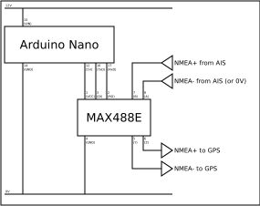

A simple Arduino project to filter out specific
[NMEA](https://en.wikipedia.org/wiki/NMEA_0183) sentences.

## Purpose

Most AIS transponders can be connected to a GPS plotter via NMEA 0183, helping
to visualise nearby vessels.

However, there does not appear to be concensus as to whether the NMEA feed
should include the location of the receiving vessel. If the transponder reports
its own location, then the plotter may constantly show a collision alarm!

This project provides a solution, by programming an
[Arduino](https://www.arduino.cc) microcontroller to filter out our own
vessel's location from the NMEA feed.

## Arduino program

The two `.ino` files in this directory contain the Arduino program, which can
be flashed to an Arduino device using the Arduino IDE.

Some notes:

 * As written, the program targets an Arduino [Nano
   Every](https://docs.arduino.cc/hardware/nano-every), which is compact and
   easy to solder onto breadboard. Its wide voltage range of 7-18V also makes
   it convenient to connect to a 12V marine power supply without having to
   worry about external power supply components.

   However, the only essential feature is a serial UART for the NMEA
   interface. A separate USB interface for programming and diagnostics is
   useful but not essential.

 * The MMSI to be filtered out is hardcoded in `NMEAFilter.ino`, as
   `discardMmsi`. You will need to change this to match the MMSI of your own
   vessel.

## Supporting circuitry and connections

With a Nano Every, the only external component needed is an RS422 transceiver
circuit, to connect the Arduino to the NMEA 0183 lines of the AIS transceiver
and GPS plotter. For this I used a
[MAX488E](https://www.maximintegrated.com/en/products/interface/transceivers/MAX488E.html)
from Maxim which is low power and ESD protected.

Note that the NMEA signal (negative voltage on the "A" or "+" line for logic 1,
positive for logic 0) is inverted compared to the TTL-level signals used by the
Arduino (+5V for logic 1, 0V for logic 0). This is addressed by connecting the
NMEA A/+ lines to the *inverting* input/output pins of the RS422 transceiver
("B"/"Z"), and the B/- lines to the *non-inverting* pins ("A"/"Y").

The complete circuit is shown below:

